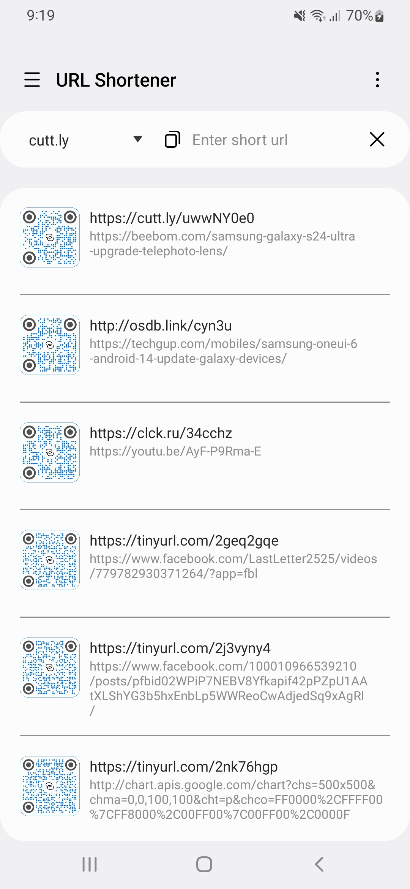
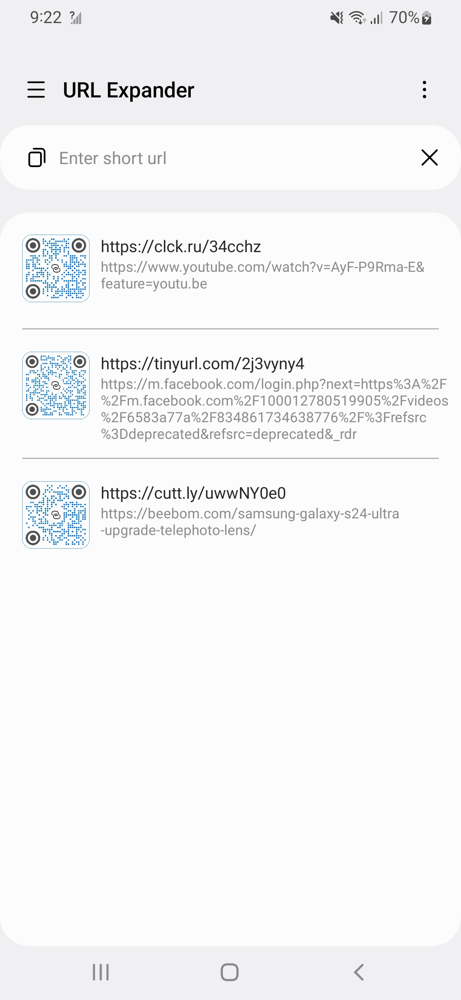
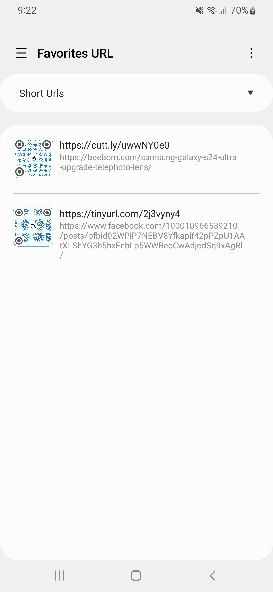
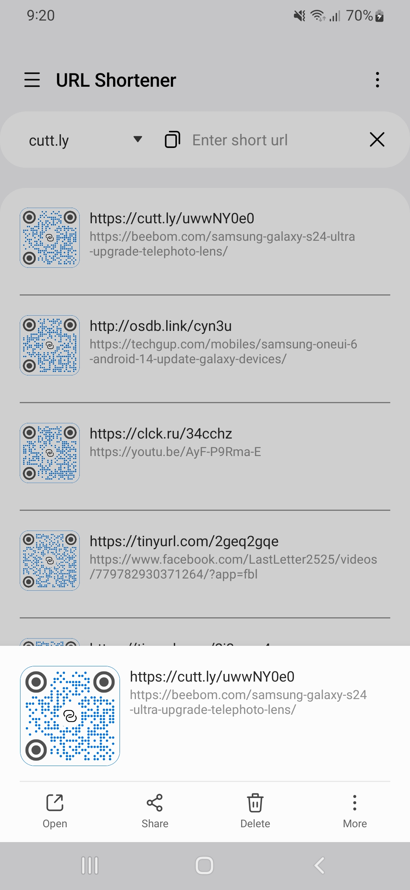
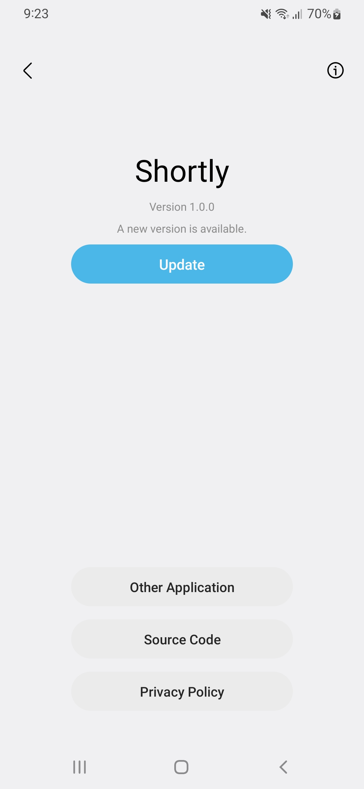

<h1 align="center">Shortly</h1>

  
  
  

  
The URL Shortener is the perfect free application for transforming long, ugly links into nice, memorable, trackable and unique short URL that will redirect to the specific website of your choosing.

 

## Screenshots

  
 

## Key Features:

* Easily shorten URLs.
* Easily Expand URLs.
* Share the links.
* Add URLs to favorites.
* Easy copying.
* QR code for urls.

## App Permissions

* INTERNET
* ACCESS_NETWORK_STATE

## 💕 Credit

* Project structure followed by [skydoves](https://github.com/skydoves)
* Icons by [svgrepo.com](https://www.svgrepo.com/)
* One UI Design Components by [oneuiproject.github.io](https://oneuiproject.github.io/)

## 💻 Installation steps

Clone or download this project in your working directory, Open using android studio, Sync the
project, build & run the project.

## 🧑 Author

#### Md. Imam Hossain

You can also follow my GitHub Profile to stay updated about my latest projects:

If you liked the repo then kindly support it by giving it a star ⭐!

Copyright (c) 2023 MD. IMAM HOSSAIN