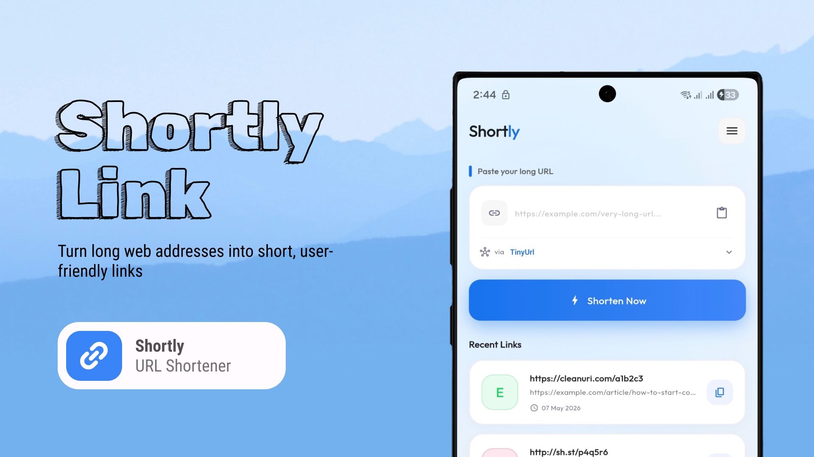
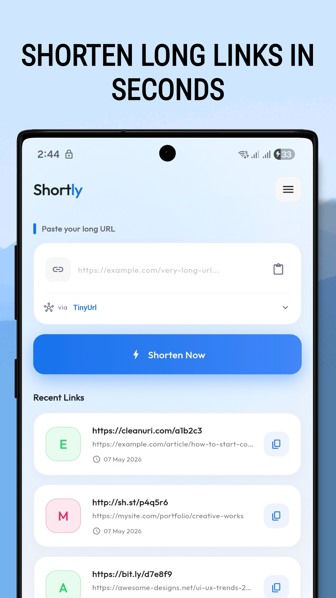
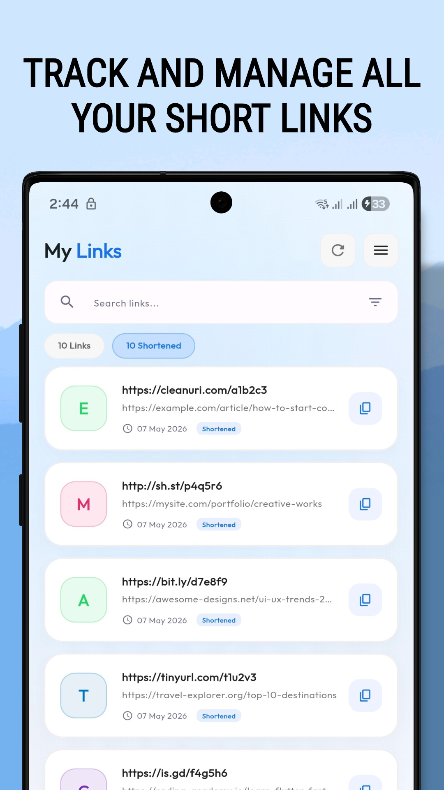
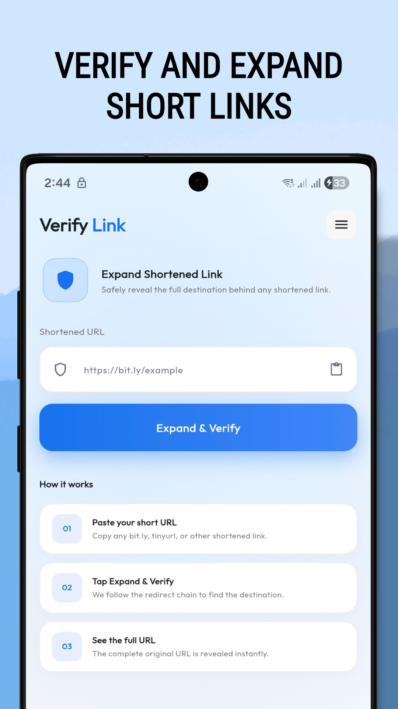
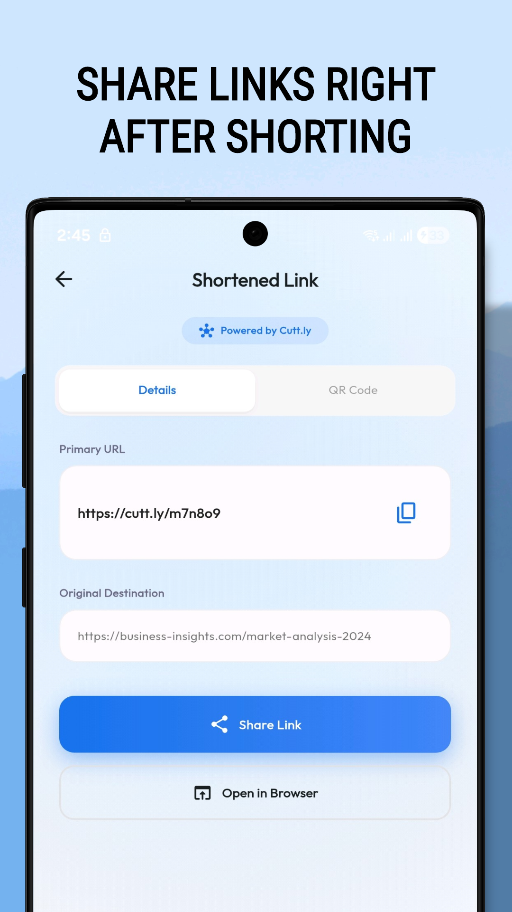
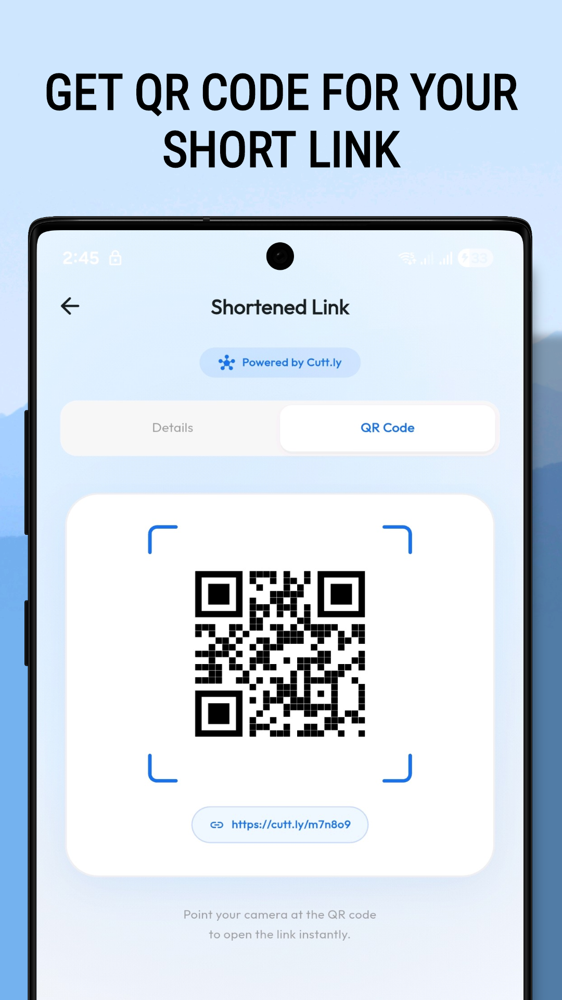

<!-- 16:9 Cover Image -->
<p align="center">
  
</p>

<h1 align="center">Shortly - Modern URL Shortener & Link Expander</h1>

<p align="center">
  <b>Turn long, messy web addresses into short, user-friendly links in seconds.</b><br>
  Built with Flutter & Riverpod for a smooth, private, and modern cross-platform experience.
</p>

<p align="center">
  <a href="https://play.google.com/store/apps/details?id=com.newagedevs.url_shortener">
    
  </a>
  
  
  
  
  
</p>

---

## 📱 Screenshots

<div align="center">
  <table>
    <tr>
      <td align="center" width="20%">
        <br/>
        <b>Shorten Links</b>
      </td>
      <td align="center" width="20%">
        <br/>
        <b>Manage History</b>
      </td>
      <td align="center" width="20%">
        <br/>
        <b>Verify & Expand</b>
      </td>
      <td align="center" width="20%">
        <br/>
        <b>Share & Open</b>
      </td>
      <td align="center" width="20%">
        <br/>
        <b>QR Code Generator</b>
      </td>
    </tr>
  </table>
</div>

---

## ✨ Features

- 🔗 **Multiple Shortener Providers**: Choose from popular, reliable URL shorteners including TinyURL, CleanURI, Clck.ru, Da.gd, Is.gd, Osdb, Bitly, and Cutt.ly.
- 🛡️ **Verify & Expand Links**: Unmask unknown or suspicious short links safely before opening them to verify their actual final destination.
- 📷 **Instant QR Code Generation**: Automatically creates a crisp, scannable QR code for every shortened link to share with mobile users effortlessly.
- 📋 **System Share Integration**: Share links directly from any web browser or third-party app straight to Shortly via Android's native share intent.
- 🗄️ **Local History & Search**: Automatically archives all your shortened and expanded links in a local, private SQLite database with quick search, filtering, and single-tap copying.
- 🎨 **Modern Material Design**: Edge-to-edge UI with fluid micro-animations powered by `flutter_animate`, with full support for Light Mode and Dark Mode.
- 🌐 **Multilingual Support (9 Languages)**: Fully localized into English, Spanish (Español), French (Français), German (Deutsch), Italian (Italiano), Portuguese (Português), Hindi (हिन्दी), Chinese (中文), and Arabic (العربية).
- 🔑 **Custom API Key Support**: Configure personal API tokens for Bitly and Cutt.ly for branded domains and personalized analytics.
- 🚫 **Ad-Free Option**: In-App Purchase support to remove advertisements permanently.

---

## 🔌 Supported Providers

| Provider | Authentication | Custom Aliases / Domains | Default |
| :--- | :---: | :---: | :---: |
| **TinyUrl** | None (Free) | No | ✅ Yes |
| **CleanURI** | None (Free) | No | Optional |
| **Clck.ru** | None (Free) | No | Optional |
| **Da.gd** | None (Free) | No | Optional |
| **Is.gd** | None (Free) | No | Optional |
| **Osdb** | None (Free) | No | Optional |
| **Cutt.ly** | API Key (Configurable) | Yes | Optional |
| **Bit.ly** | API Key (Configurable) | Yes | Optional |

---

## 🛠️ Tech Stack & Architecture

- **Framework**: [Flutter](https://flutter.dev/) (Channel stable, Dart 3.x)
- **State Management**: [flutter_riverpod](https://pub.dev/packages/flutter_riverpod)
- **Local Storage**: [sqflite](https://pub.dev/packages/sqflite) (SQLite) & [shared_preferences](https://pub.dev/packages/shared_preferences)
- **Networking**: [http](https://pub.dev/packages/http) & [html](https://pub.dev/packages/html)
- **QR Code Engine**: [qr_flutter](https://pub.dev/packages/qr_flutter)
- **Animation & Typography**: [flutter_animate](https://pub.dev/packages/flutter_animate) & [google_fonts](https://pub.dev/packages/google_fonts)
- **Services & Utilities**:
  - `share_plus` — Native system sharing
  - `url_launcher` — External browser launching
  - `receive_sharing_intent` — Receiving shared URLs from other apps
  - `in_app_purchase` — Premium upgrade (Remove Ads)
  - `applovin_max` — Ad network mediation
  - `in_app_review` & `in_app_update` — Play Store reviews & flexible in-app updates

---

## 🚀 Getting Started

### Prerequisites

- Flutter SDK `^3.11.5` or higher installed ([Install Flutter](https://docs.flutter.dev/get-started/install))
- Android Studio / VS Code with Flutter extension
- An Android device or emulator running Android 6.0 (API level 23) or higher

### Installation

1. **Clone the repository:**
   ```bash
   git clone https://github.com/imamhossain94/Shortly.git
   cd Shortly
   ```

2. **Install dependencies:**
   ```bash
   flutter pub get
   ```

3. **Generate localization files (if needed):**
   ```bash
   flutter gen-l10n
   ```

4. **Run the application:**
   ```bash
   flutter run
   ```

### Building Release APK / App Bundle

```bash
# Android App Bundle (AAB)
flutter build appbundle --release

# Android APK
flutter build apk --release
```

---

## 📁 Project Structure

```text
Shortly/
├── android/               # Native Android configurations & Kotlin code
├── assets/                # App icons and graphics
├── lib/
│   ├── core/              # Theme, constants, network & service singletons
│   │   ├── services/      # AdService, IapService, UpdateService
│   │   ├── constants.dart # Provider endpoints, AppLovin & IAP keys
│   │   └── theme.dart     # Light & dark theme palettes
│   ├── data/              # Database helper & repository layers
│   │   └── db/            # SQLite implementation (history, URLs)
│   ├── l10n/              # Localization files (.arb & generated classes)
│   ├── presentation/      # UI Layer
│   │   ├── providers/     # Riverpod StateNotifiers & providers
│   │   ├── screens/       # Shortener, Expander, History, Result, QR, About
│   │   └── widgets/       # Reusable components, sheets, and cards
│   └── main.dart          # Entry point & root widget
├── preview/               # Cover graphic (16:9) & store screenshots
├── pubspec.yaml           # App configuration & package dependencies
└── README.md
```

---

## 🔒 Privacy & Permissions

Shortly respects user privacy:
- Shortened URLs and history records are saved **locally on your device** via SQLite.
- Only the URLs you choose to shorten or expand are sent to the designated shortener API endpoint.
- For more details, review the [Privacy Policy](https://url-shortener-privacy-policy.blogspot.com/2021/11/privacy-policy-md.html).

---

## 👨‍💻 Author

**Imam Hossain**
- Google Play: [NewAgeDevs](https://play.google.com/store/apps/dev?id=5785086860664884952)
- GitHub: [@imamhossain94](https://github.com/imamhossain94)
- Email: [imamagun94@gmail.com](mailto:imamagun94@gmail.com)

---

## 📄 License

This project is licensed under the MIT License - see the LICENSE file for details.
